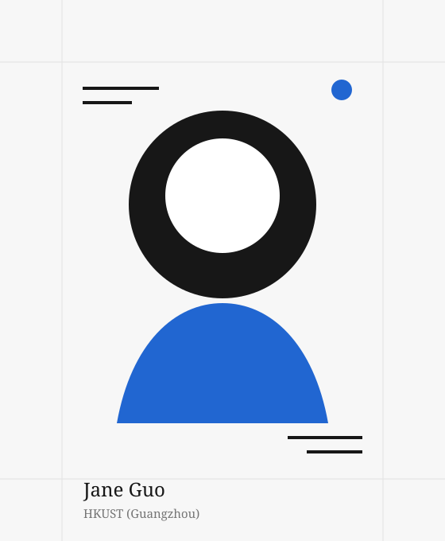

# Jane Guo Personal Website

这是一个不依赖框架的静态个人网站。原版本保留在同级目录 `personal-website`，当前整理后的版本位于 `Career/website`。

## 文件与栏目对应关系

- `index.html`：主页，包括 About、News、Contact。
- `project.html`：Project 详情页。
- `research.html`：Research 详情页。
- `honor.html`：Honor 详情页。
- `education.html`：Education 详情页。
- `skill.html`：Skill 详情页。
- `extracurricular.html`：Extracurricular Activity 详情页。
- `blog.html`：独立 Blog 页面。
- `styles.css`：所有页面共用的字体、颜色、间距、卡片和移动端样式。
- `social-links.js`：小红书、Instagram、LinkedIn、GitHub 的账号链接。
- `overview-image.svg`：About / Overview 中的图片。

## 修改网页内容

1. 用文本编辑器打开需要修改的 `.html` 文件。
2. 搜索页面上当前显示的文字，直接修改标签之间的文本。
3. 不要修改 `href` 指向的文件名，除非同时修改对应文件名。
4. 保存后刷新浏览器即可看到效果。

例如，要修改 Tianchi 项目，请编辑 `project.html`；要修改时间线，请编辑 `index.html` 中 `id="news"` 的部分。

## 修改社交账号链接

打开 `social-links.js`，将引号中的空字符串替换为完整账号网址：

```js
const socialLinks = {
  xiaohongshu: "你的完整小红书主页网址",
  instagram: "你的完整 Instagram 主页网址",
  linkedin: "你的完整 LinkedIn 主页网址",
  github: "https://github.com/hahaha-dot",
};
```

未填写网址的平台图标会自动显示为未启用状态，不会跳转到错误账号。

## 替换 Overview 图片

最简单的方法是把新图片放入 `website` 文件夹，然后修改 `index.html` 中这一行：

```html

```

例如替换为 `profile.jpg`：

```html

```

## 本地预览

在 `website` 文件夹运行：

```bash
python3 -m http.server 3000
```

然后打开 `[http://localhost:3000/](https://hahaha-dot.github.io/)`。

## 更新公开网站

公开仓库是 `https://github.com/hahaha-dot/hahaha-dot.github.io`。修改完成后，将 `website` 文件夹中的文件上传并覆盖仓库根目录中的同名文件；GitHub Pages 会自动更新 `https://hahaha-dot.github.io/`。
